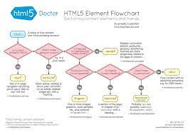

# Facebook clone

Ladda ner filen [semantic.html](assets/semantic.html) och följ instruktionerna i html dokumentet

För hintar om hur du kan tänka kring de vanligare semantiska taggarn se nedanstående bilden

För en mer detaljerad dokumentation kring semantiska taggar se [MDN Glossary Semantic tags](https://developer.mozilla.org/en-US/docs/Glossary/Semantics)